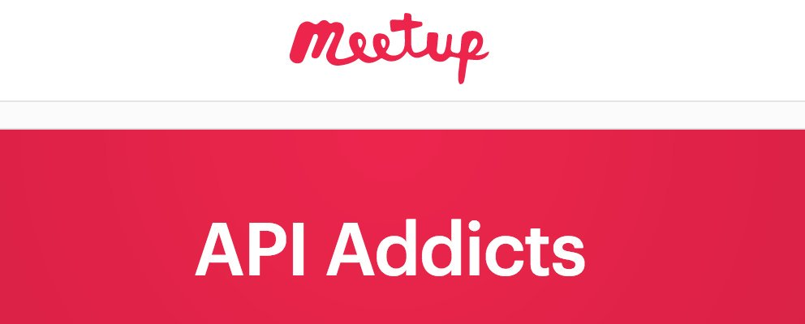

# WORKSHOP DE APIS
[API-Addicts](https://twitter.com/apiaddicts/) y CampusFP organizan su primer workshop de APIs destinado a la gente que está estudiando.
De carácter básico, aborda temas introductorios en el mundo de las APIs y como consumirlas.

- Introducción al mundo de las APIs por [Marco Antonio](https://twitter.com/MarAntonio82)
- App demo en angular por [Jorge Baumann](https://twitter.com/baumannzone)

### API-ADDICTS
Esta es la página del evento: https://www.meetup.com/es-ES/ApiAddicts/events/240662192/

### Ejemplo

### Requsitos
- Node.js (version +6)
- Git
- Editor de texto (Recomendamos [Visual Studio Code](https://code.visualstudio.com/))

### Uso
Primero ejecutar el el mock-api y despues correr la app.

#### Mock API
Desde la consola de comandos (en cualquier ruta) instalamos el paquete json-server de manera global:  
`npm install -g json-server`

En la carpeta del proyecto vamos a la carpeta `/data` y ejecutamos el siguiente comando desde la consola:   
`json-server --watch users.json --routes routes.json`  
Esto será nuestra API que estará corriendo por defecto en la url: `http://localhost:3000` 

#### APP
En carpeta del proyecto, sin cerrar la consola, abrimos otra pestaña  y usamos el siguiente comando para instalar 
todos los paquetes necesarios para correr la aplicación:
`npm install`  

Una vez tengamos todo instalado, podemos correr la app con el siguiente comando:
`npm run serve`  
  
Si todo ha ido bien, debería correr la aplicacion en la url: `http://localhost:3001`

### License
[MIT](./license)
